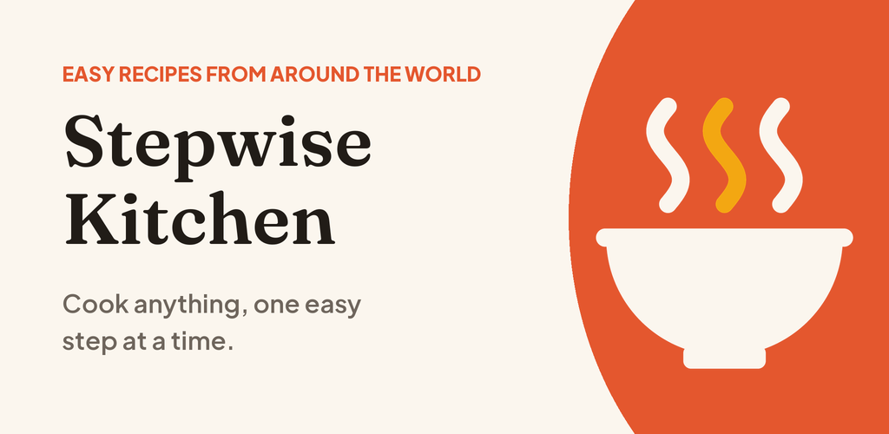

# Stepwise Kitchen

A calm, offline recipe app built with Flutter: 32 hand-written recipes from around the world, a daily pick, ingredient checklists and a step-by-step Cook Mode. No account, no ads, no network access.



## Features

- **Discover**: a daily recipe pick (or a random one), a "Ready in 30 minutes" row, and browsing by category
- **Recipe pages**: total time, servings, difficulty, an ingredient checklist you can tick off, and numbered steps
- **Cook Mode**: one large step per screen with a progress bar
- **Search**: instant matching on dish, cuisine, tag or ingredient
- **Saved**: favourites stored on the device
- Light and dark themes, bundled fonts, and it works fully offline

## Getting started

```sh
flutter pub get
flutter run
flutter test
```

## Project layout

```
assets/data/recipes.json     All recipes and categories (validated by flutter test)
assets/fonts/                Fraunces + Plus Jakarta Sans (OFL)
assets/icon/                 Launcher icon sources (flutter_launcher_icons)
lib/models/recipe.dart       Recipe, Ingredient, RecipeCategory
lib/services/                Recipe repository and on-device favourites
lib/theme/app_theme.dart     Colours, typography, light/dark themes
lib/views/                   Discover, Search, Saved, recipe detail, Cook Mode
docs/                        Privacy policy (GitHub Pages) and Play Store listing
```

## Adding a recipe

Append an entry to `recipes` in `assets/data/recipes.json`:

```json
{
  "id": "unique-kebab-case-id",
  "name": "Dish Name",
  "category": "Pasta",
  "cuisine": "Italian",
  "emoji": "🍝",
  "prepMinutes": 10,
  "cookMinutes": 20,
  "servings": 4,
  "difficulty": "Easy",
  "tags": ["Quick", "Vegetarian"],
  "description": "One enticing sentence.",
  "ingredients": [["200 g", "Spaghetti"], ["2 tbsp", "Olive oil"]],
  "steps": ["First step.", "Second step."]
}
```

`category` must match one of the `categories`. To show a photo instead of the illustrated card, add `"image": "assets/photos/dish.jpg"` and list that folder under `assets:` in `pubspec.yaml`. Run `flutter test` afterwards to catch mistakes.

## Releasing

See [PUBLISHING.md](PUBLISHING.md) for signing and building, and [docs/store-listing.md](docs/store-listing.md) for the Play Store text and graphics. The privacy policy lives at `docs/privacy-policy.html`.
